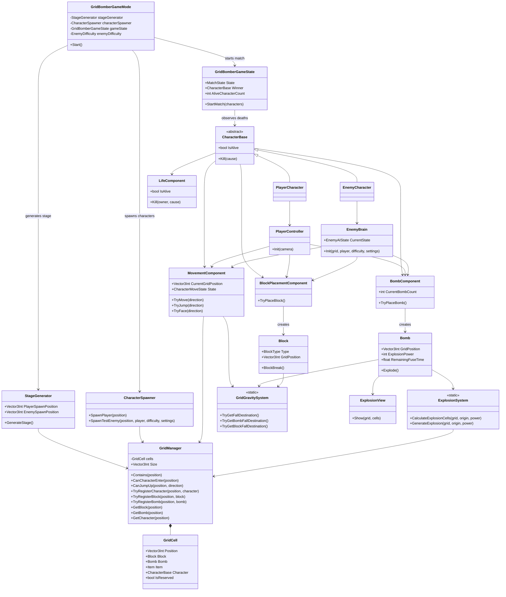
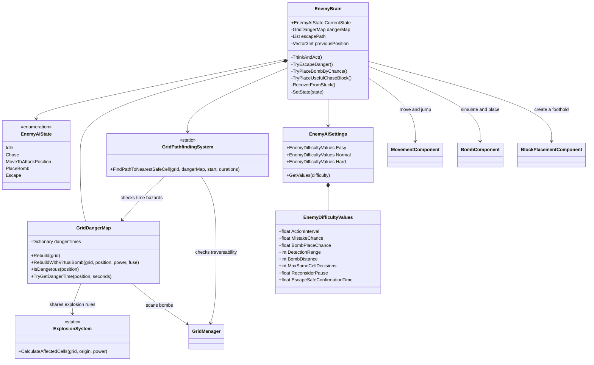
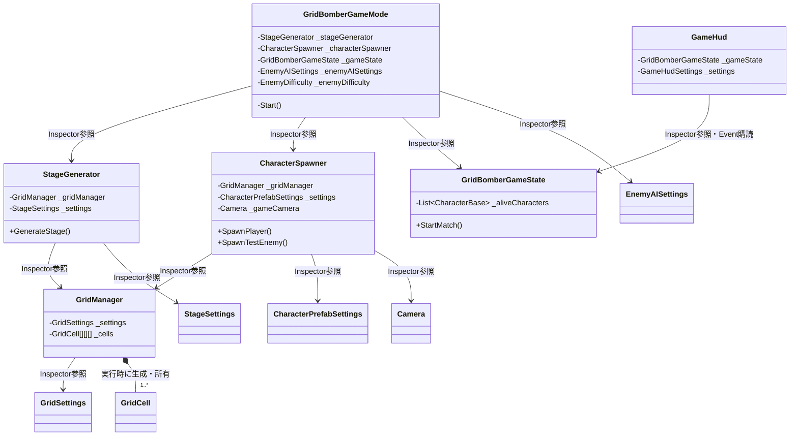
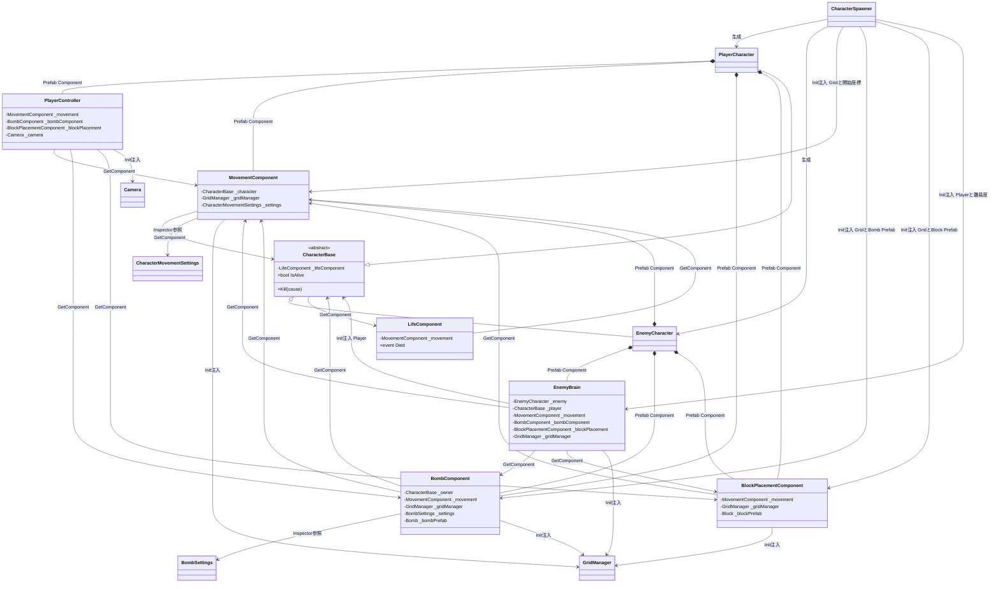
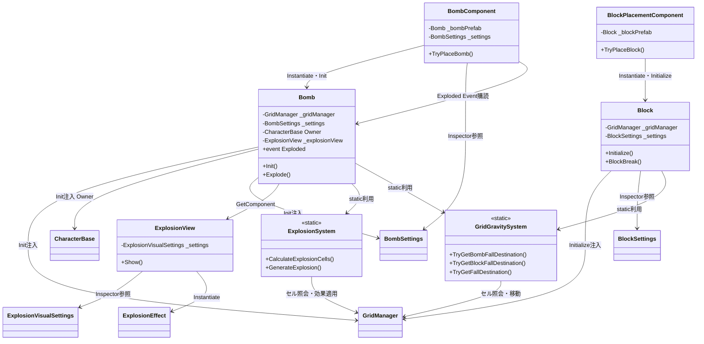
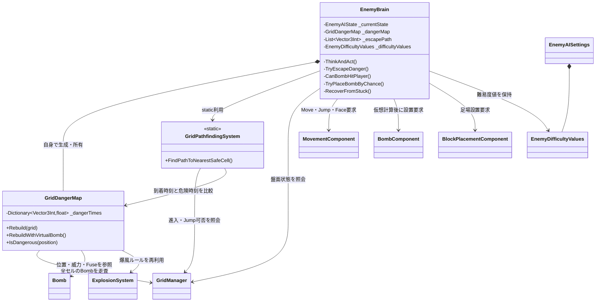

# 3D Grid Bomber クラス図

現在実装されている主要クラスの関係を示す。`--|>`は継承、`*--`は所有、`-->`は参照・利用を表す。

## 全体構造



## Enemy AI内部



## Enemyの判断順

```text
DangerMap更新
  → 危険ならEscape
  → Escape解除待ちなら安全地点で待機
  → 同一行動を繰り返したらStuck回復
  → 攻撃可能ならPlaceBomb
  → 攻撃位置があればMoveToAttackPosition
  → Player検知中ならChase
  → それ以外はIdle
```

---

# 参照関係の詳細図

## 矢印の読み方

| 表記 | 意味 | 設定される場所 |
|---|---|---|
| `Inspector参照` | `[SerializeField]`で保持する参照 | SceneまたはPrefabのInspector |
| `Init注入` | 生成後に`Init()`から渡される参照 | `CharacterSpawner`など |
| `GetComponent` | 同じGameObjectから取得する参照 | 各Componentの`Awake()`など |
| `生成` | `Instantiate()`で生成する | Spawner、BombComponentなど |
| `購読` | C# eventを監視する | GameState、BombComponentなど |
| `static利用` | インスタンスを保持せず関数だけ呼ぶ | Utility／Systemクラス |

## 1. Sceneとゲーム開始時の参照



開始順は`GameMode.Start()`から、`StageGenerator.GenerateStage()`、Character生成、`GameState.StartMatch()`の順になる。

## 2. Character Prefab内部とInit参照



`PlayerController`と`EnemyBrain`は判断元だけが異なり、実際の行動は共通Componentへ依頼する。

## 3. Bomb、Block、Explosion、Gravity



## 4. Enemy AIの参照とデータの流れ



Enemy AIの処理データは次のように流れる。

```text
GridManager上のBomb
  → GridDangerMap
  → ExplosionSystemで爆風セル計算
  → セルごとの危険時刻
  → GridPathfindingSystemで安全経路計算
  → EnemyBrainが行動を選択
  → Movement / Bomb / BlockPlacement Componentへ要求
  → GridManager上の状態が更新される
```

## 5. ScriptableObjectの参照

```mermaid
classDiagram
    class GameConfig {
        <<ScriptableObject Catalog>>
    }
    class GridSettings
    class CharacterMovementSettings
    class CharacterPrefabSettings
    class BombSettings
    class BlockSettings
    class StageSettings
    class EnemyAISettings
    class ExplosionVisualSettings
    class GameHudSettings

    class GridManager
    class MovementComponent
    class CharacterSpawner
    class BombComponent
    class Bomb
    class Block
    class StageGenerator
    class GridBomberGameMode
    class ExplosionView
    class GameHud

    GameConfig --> GridSettings : カタログ参照
    GameConfig --> CharacterMovementSettings : カタログ参照
    GameConfig --> CharacterPrefabSettings : カタログ参照
    GameConfig --> BombSettings : カタログ参照
    GameConfig --> StageSettings : カタログ参照
    GameConfig --> EnemyAISettings : カタログ参照
    GameConfig --> ExplosionVisualSettings : カタログ参照
    GameConfig --> GameHudSettings : カタログ参照

    GridManager --> GridSettings : Inspector参照
    MovementComponent --> CharacterMovementSettings : Inspector参照
    CharacterSpawner --> CharacterPrefabSettings : Inspector参照
    BombComponent --> BombSettings : Inspector参照
    Bomb --> BombSettings : Init注入
    Block --> BlockSettings : Inspector参照
    StageGenerator --> StageSettings : Inspector参照
    GridBomberGameMode --> EnemyAISettings : Inspector参照
    ExplosionView --> ExplosionVisualSettings : Inspector参照
    GameHud --> GameHudSettings : Inspector参照
```



`GameConfig`は一覧用カタログであり、現在のRuntime Componentは`GameConfig`経由ではなく、必要なSettingsを直接参照している。
